# Temporal Trends, Spatial Patterns, and Social Inequalities in Gestational and Congenital Syphilis in Brazil, 2007--2023

> A nationwide ecological study integrating joinpoint regression, spatial epidemiology, inequality measurement, and multivariable modelling across 5,570 Brazilian municipalities.

[](http://tabnet.datasus.gov.br)
[](https://ivs.ipea.gov.br)
[](https://opensource.org/licenses/MIT)
[](https://www.r-project.org/)

---

## Key Findings

| Indicator | Result |
|-----------|--------|
| Gestational syphilis cases (2007--2023) | **666,176** |
| Congenital syphilis cases (2007--2023) | **297,062** |
| Global Moran's I (gestational syphilis) | **0.599** (p < 2.2e-16) |
| LISA High-High clusters | **413 municipalities** |
| IVS x Syphilis correlation (Spearman) | **rho = -0.316** (p < 2.2e-16) |
| Bivariate Moran (IVS x syphilis) | **-0.357** (p = 0) |
| Best spatial model (SAR vs OLS) | AIC: **57,353 vs 60,206** |

---

## Figures

### Temporal Trends -- Brazil (2007--2023)

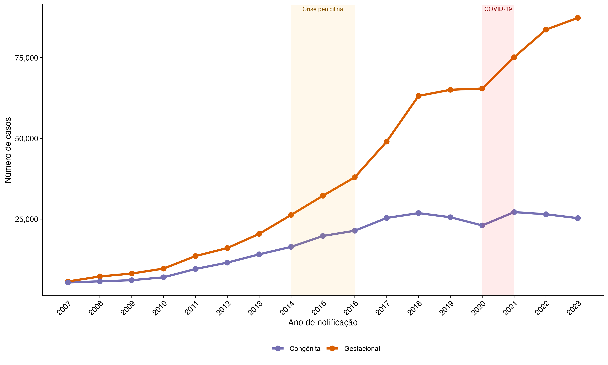

### Temporal Trends by Macro-region

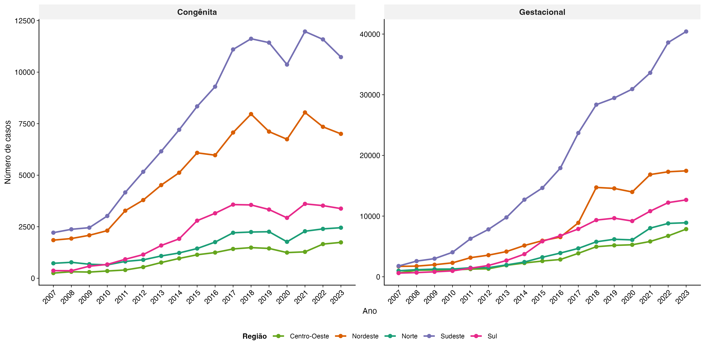

### Joinpoint Analysis -- Segmented Regression

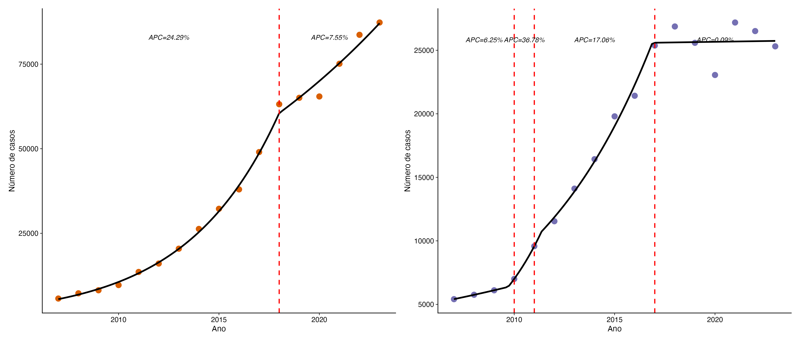

### Forest Plot -- APC by State

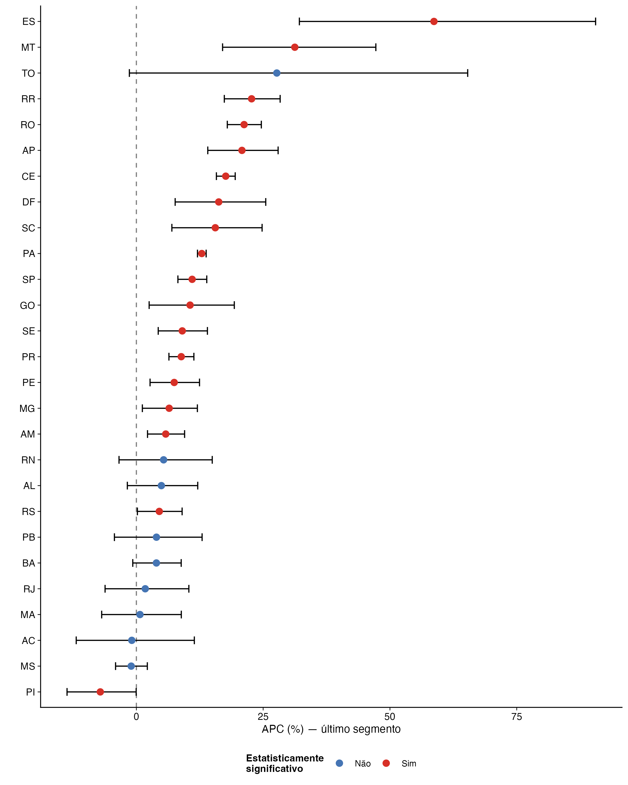

### Interrupted Time Series -- COVID-19 Impact

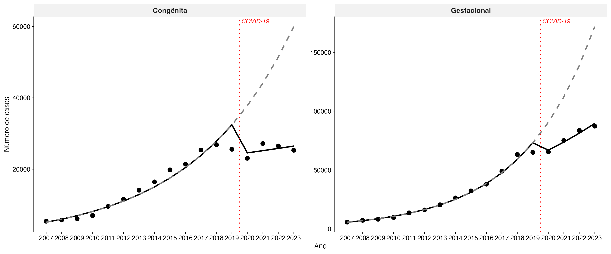

### Distribution by Maternal Race/Colour

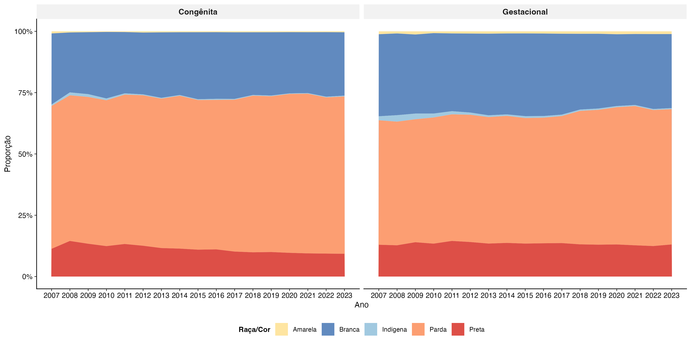

### Syphilis Rates by Social Vulnerability (IVS)

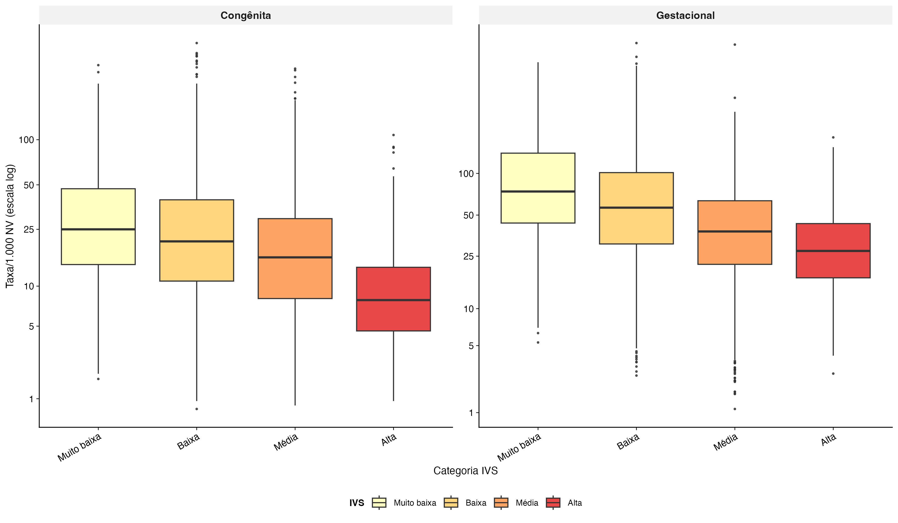

### Concentration Curve (SII / Concentration Index)

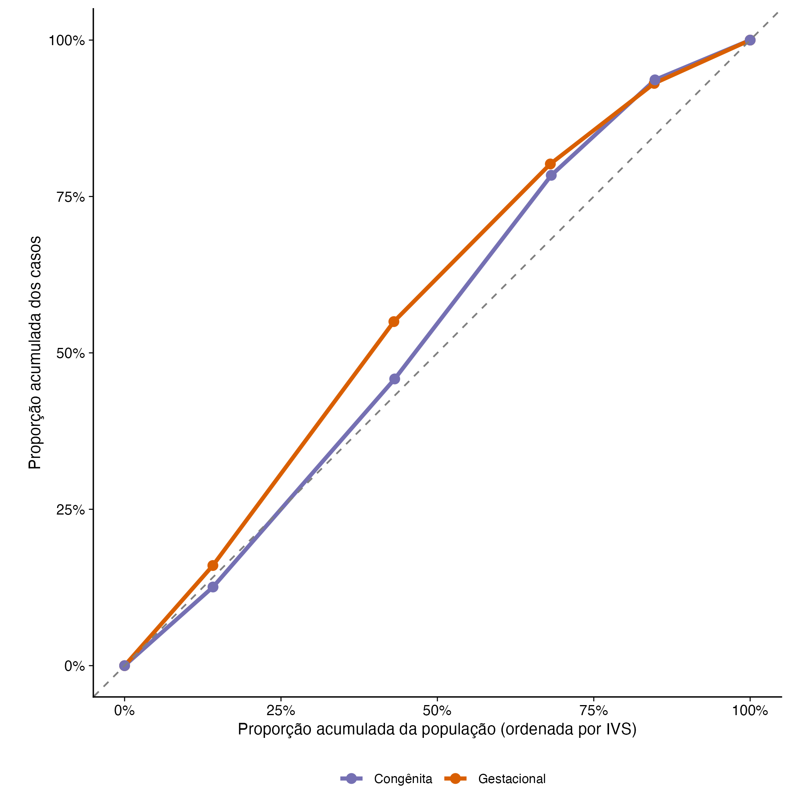

### Temporal Evolution of Inequality Indices

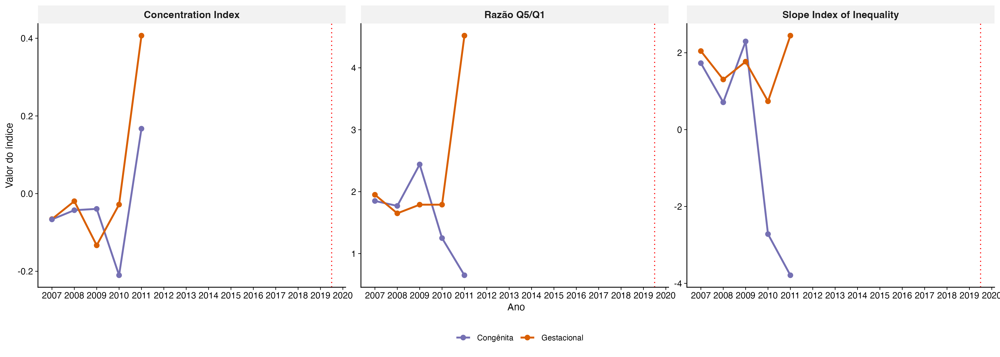

### Race x IVS Interaction

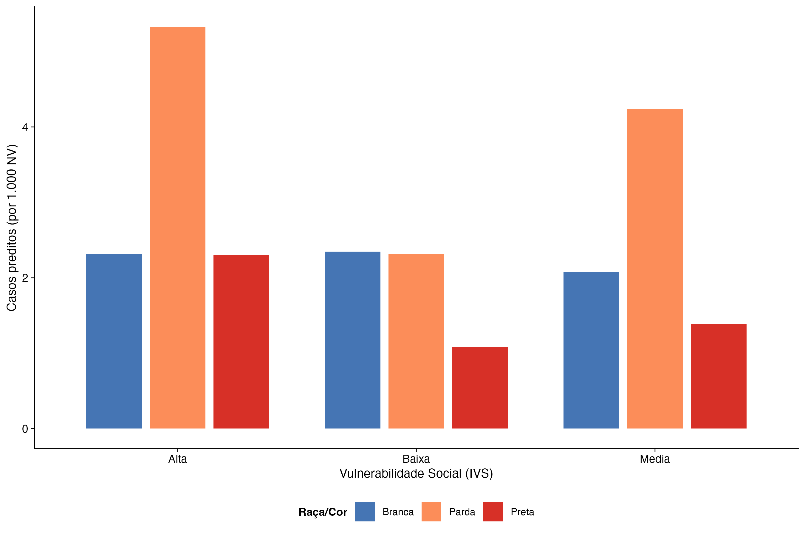

---

## Maps

### Empirical Bayes Smoothed Rates -- Gestational Syphilis

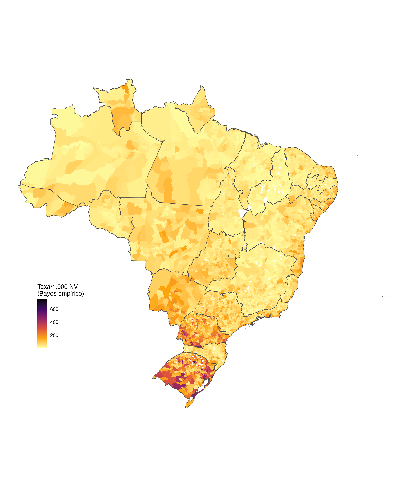

### LISA Clusters -- Gestational Syphilis

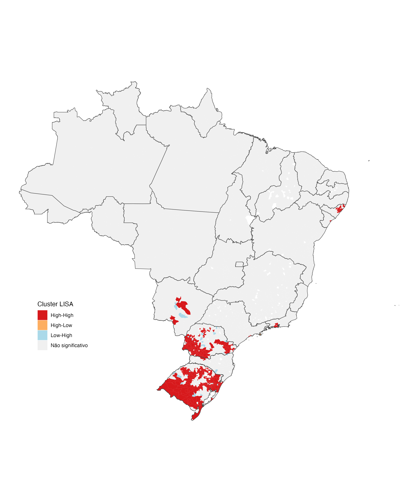

### Spatio-temporal LISA Comparison (2007--2011 vs 2012--2017 vs 2020--2023)

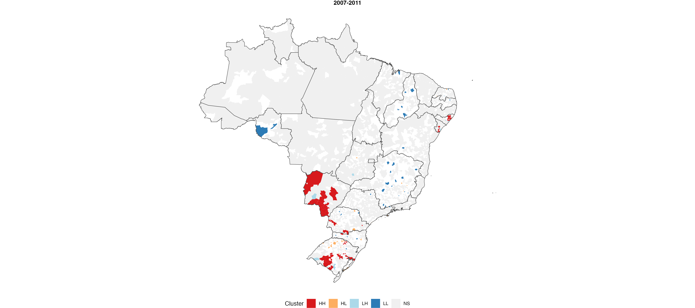

### Congenital-to-Gestational Syphilis Ratio

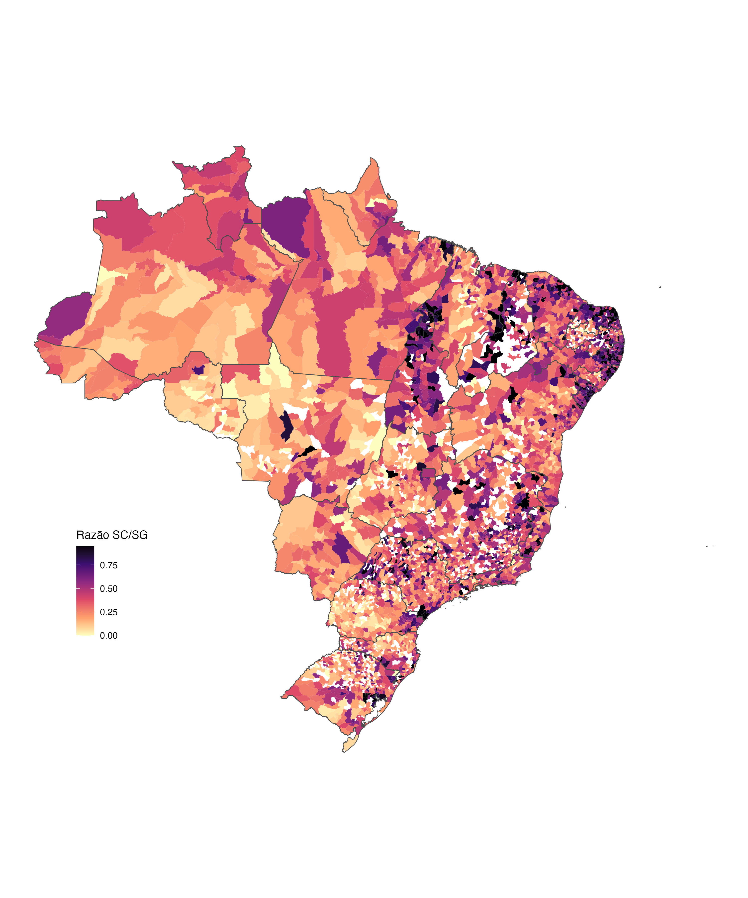

---

## Data Sources

| Source | Description | Period |
|--------|-------------|--------|
| [SINAN/DataSUS](http://tabnet.datasus.gov.br) | Gestational and congenital syphilis notifications | 2007--2023 |
| [SINASC/DataSUS](http://tabnet.datasus.gov.br) | Live births (denominators) | 2007--2023 |
| [IVS/IPEA](https://ivs.ipea.gov.br) | Social Vulnerability Index (municipal level) | 2010 |
| [geobr/IBGE](https://github.com/ipeaGIT/geobr) | Municipal boundary shapefiles | 2020 |

---

## Methods

### Temporal Analysis
- **Joinpoint / Segmented regression** -- APC, AAPC with 95% CI
- **Prais-Winsten** -- sensitivity analysis for serial autocorrelation
- **Negative binomial** -- sensitivity analysis with log(NV) offset
- **Interrupted time series (ITS)** -- COVID-19 impact assessment

### Spatial Analysis
- **Empirical Bayes smoothing** -- rate stabilisation for small areas
- **Global Moran's I** -- overall spatial autocorrelation
- **LISA** -- local clusters (High-High, Low-Low, High-Low, Low-High)
- **Bivariate Moran** -- IVS x syphilis spatial co-clustering
- **Spatio-temporal comparison** -- LISA across policy periods

### Inequality Measurement
- **Slope Index of Inequality (SII)** -- absolute inequality
- **Concentration Index (CI)** -- relative inequality
- **Concentration curves** -- visual inequality assessment
- **Temporal trends** -- widening or narrowing of inequalities

### Multivariable Modelling
- **Negative binomial regression** -- IVS + macro-region + offset(NV)
- **Multilevel Poisson (GLMM)** -- random intercept by state (ICC)
- **SAR / SEM spatial models** -- accounting for spatial dependence
- **Race x IVS interaction model** -- intersectional analysis

---

## Repository Structure

```
R_analysis/
  analise_completa_sifilis.R       # Complete single-script pipeline (~3,000 lines)
  data/
    raw/                            # SINAN DBC files + IVS (not tracked)
    processed/                      # Processed RDS files (not tracked)
  output/
    tables/                         # 14 Excel tables
    figures/                        # 12 publication-ready figures (PNG + PDF)
    maps/                           # 4 choropleth and LISA maps
    models/                         # Fitted spatial models (RDS)
    supplementary/                  # Supplementary material
manuscript/
  manuscript_syphilis_brazil.md     # Full manuscript draft (Lancet style)
```

---

## Reproducibility

### Requirements
- R >= 4.5
- Key packages: `tidyverse`, `sf`, `spdep`, `spatialreg`, `segmented`, `MASS`, `lme4`, `geobr`, `read.dbc`, `prais`

### Running the analysis

```r
# Set working directory to R_analysis/
setwd("R_analysis")

# Run the complete pipeline
source("analise_completa_sifilis.R")
```

The script will:
1. Download SINAN data from DataSUS (syphilis notifications)
2. Download cartographic data via `geobr`
3. Clean and process all data
4. Run all 12 analytical parts
5. Export all tables, figures, and maps

---

## Tables Generated

| Table | Content |
|-------|---------|
| Tabela1_Brasil_anual | Annual cases and rates, Brazil |
| Tabela2_Regiao_anual | Cases by macro-region and year |
| Tabela_UF_anual | Cases by state and year |
| Tabela_Raca_Cor_anual | Cases by maternal race/colour |
| Tabela_Joinpoint_Completa | APC/AAPC by segment, region, state |
| Tabela_Sensibilidade_Temporal | Prais-Winsten and NB sensitivity |
| Tabela_Moran_Global | Global Moran's I results |
| Tabela_IVS_estratos | Rates by IVS quintile |
| Tabela_Indices_Desigualdade | SII and Concentration Index |
| Tabela_Desigualdades_Raciais | Rate ratios by race/colour |
| Tabela_ITS_COVID | Interrupted time series results |
| Tabela_Modelos_Multivariados | BN, GLMM, SAR/SEM results |
| Tabela_Modelo_Interacao_Raca_IVS | Race x IVS interaction IRRs |
| Tabela_Clusters_HH_Persistentes | Persistent hotspot municipalities |

---

## Supplementary Material

- **Dicionario_Variaveis.xlsx** -- Variable dictionary
- **STROBE_Checklist_Ecologico.xlsx** -- STROBE checklist for ecological studies
- **Fluxograma_Analitico.txt** -- Analytical flowchart
- **Tabela_Supl_UF_Completa.xlsx** -- Full state-level indicators
- **Tabela_Supl_Joinpoint_UF.xlsx** -- Joinpoint results by state
- **Tabela_Supl_Comparacao_Metodos.xlsx** -- Trend methods comparison
- **Fig_Supl_UF_Panel.png** -- Small multiples: trends by state

---

## Citation

Victor A. Temporal trends, spatial patterns, and social inequalities in gestational and congenital syphilis in Brazil, 2007--2023: a nationwide ecological study. *[Manuscript in preparation]*. 2026.

## Author

**Audencio Victor**
London School of Hygiene and Tropical Medicine (LSHTM)

---

## License

This project is licensed under the MIT License. Data from DataSUS and IPEA are publicly available under Brazilian open data regulations.
